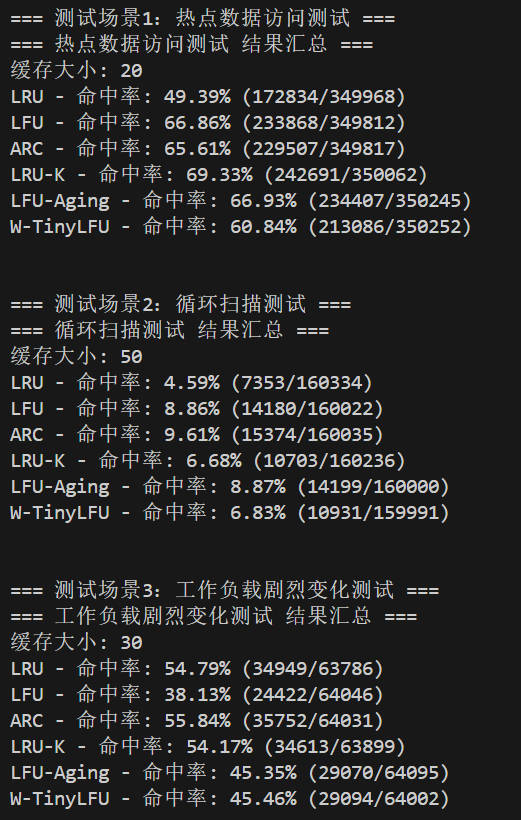

# CacheSystem

这是一个基于[KamaCache](https://github.com/youngyangyang04/KamaCache)的学习项目，在复现的基础上添加其他常见算法并添加了工程化的gtest测试框架。

## 项目简介

本项目是一个高性能缓存系统的实现，旨在学习和理解缓存机制的工作原理。在参考KamaCache项目的基础上，实现了核心的缓存功能，并添加了常见高效的缓存算法。

## 与KamaCache的对比与创新

### 基础功能复现

- 完整复现了KamaCache的三种核心缓存策略：LRU、LFU和ARC
- 保留了KamaCache的优化特性，如LRU分片、LFU分片和最大平均访问频次
- 采用相似的架构设计，使用模板化实现支持任意键值类型

### 主要创新点

#### 1. 高级缓存算法实现

- **W-TinyLFU算法**：实现Window-TinyLFU混合策略
  - 1% Window LRU + 99% Victim Cache设计
  - Count-Min Sketch频率估算器
  - 基于频率的准入策略
  - 定期衰减机制防止频率饱和
- **LRU-K算法**：实现K-distance缓存策略
  - 历史队列自动设置为缓存容量的2.5倍
  - K次访问后提升到主缓存
  - 强大的扫描抵抗能力
- **多策略并行运行**：同时维护LRU、LFU、LFU-Aging、ARC、W-TinyLFU和LRU-K六种缓存策略
- **性能监控**：实时统计各策略的命中率
- **动态切换**：根据性能数据自动选择最优策略
- **平滑过渡**：使用可配置的切换阈值，避免频繁切换

#### 2. 改进的LFU-Aging策略

- **更精细的频率衰减机制**：
  - 引入可配置的衰减因子(agingFactor)，替代固定的减半操作
  - 基于操作次数和平均频率双重触发条件
  - 更平滑的频率衰减曲线，避免过度调整
- **动态参数调整**：
  - 可配置的衰减阈值(agingThreshold)
  - 可配置的衰减因子(agingFactor)
  - 支持不同场景下的参数优化

#### 3. 更频繁的性能评估

- KamaCache：基于时间间隔的评估
- CacheSystem：基于操作次数的评估（每1000次操作评估一次）
- 更快的响应速度，适应快速变化的访问模式

#### 4. 更敏感的策略切换

- 可配置的切换阈值（默认2%）
- 避免频繁切换导致的性能抖动
- 保持统计连续性，不重置性能数据

#### 5. 增强的测试用例

- 工作负载变化测试：模拟不同阶段的访问模式
- 策略切换可视化：实时显示当前使用的策略
- 多场景测试：热点访问、扩展访问、大范围访问等

### 性能优化

- 更智能的内存管理，减少内存碎片
- 优化的数据结构，提高访问效率
- 细粒度的锁控制，减少线程竞争

## 特性

- 基于KamaCache的核心功能实现，使用C++17标准
- 实现了多种经典缓存替换策略：
  - LRU (Least Recently Used)
  - LFU (Least Frequently Used)
  - LFU with Aging（改进版）
  - ARC (Adaptive Replacement Cache)
  - W-TinyLFU (Window-TinyLFU)
  - LRU-K (K-distance LRU)
- **自适应算法**：根据访问模式动态选择最优缓存策略
- 线程安全的实现，支持多线程环境
- 模板化设计，支持任意键值类型

## 项目结构

```
CacheSystem/
├── XWTinyLFUCache.h          # W-TinyLFU缓存实现
├── XLRUCache.h               # LRU和LRU-K缓存实现
├── XLFUCache.h               # LFU缓存实现（含改进的LFU-Aging）
├── XCachePolicy.h            # 缓存策略基类接口
├── XArcCache/                # ARC缓存实现
│   ├── XArcCache.h           # ARC缓存主类
│   ├── XArcLRUpart.h         # ARC的LRU部分
│   ├── XArcLFUpart.h         # ARC的LFU部分
│   └── XArcCacheNode.h       # ARC缓存节点
├── cache_test.cpp             # Google Test单元测试
├── testAllCachePolicy.cpp      # 所有缓存策略性能测试
├── CMakeLists.txt              # CMake构建文件（集成GTest）
└── README.md                   # 项目说明文档
```

## 快速开始

### 编译项目

```bash
# 在项目根目录下执行
mkdir build && cd build
cmake ..
make
```

### 运行测试

```bash
# 运行Google Test单元测试
./cache_test

# 运行所有缓存策略性能测试
./testAllCachePolicy
```

## 测试框架

本项目集成了完整的测试框架，包含两种测试方式：

### Google Test单元测试 (cache_test.cpp)

- **基本功能测试**：验证所有缓存算法的put/get操作正确性
- **容量限制测试**：测试缓存淘汰机制
- **热点数据访问测试**：70%热点+30%冷数据访问模式
- **循环扫描测试**：60%顺序扫描+30%随机跳跃+10%范围外访问
- **工作负载变化测试**：5个阶段的不同访问模式
- **性能测试**：10000次混合操作的性能基准测试
- **参数化测试**：不同容量下的缓存行为验证

### 性能对比测试 (testAllCachePolicy.cpp)

- **热点数据访问测试**：500,000次操作，测试热点数据识别能力
- **循环扫描测试**：200,000次操作，测试扫描抵抗能力  
- **工作负载变化测试**：80,000次操作，测试适应性

所有测试都支持六种缓存算法：LRU、LFU、ARC、LRU-K、LFU-Aging、W-TinyLFU

## 测试结果

最新测试结果显示各算法在不同场景下的性能表现：

#### 热点数据访问测试（缓存大小：20）

- **LRU-K**: 69.33% (K-distance优势)
- **LFU**: 66.81% (纯频率优势)
- **ARC**: 65.38% (自适应优势)
- **LFU-Aging**: 66.91% (带衰减的频率)
- **W-TinyLFU**: 60.93% (频率+时间优势)
- **LRU**: 49.60% (基准)

#### 循环扫描测试（缓存大小：50）

- **ARC**: 9.66% (扫描抵抗能力最强)
- **LFU-Aging**: 8.86% (带衰减的频率)
- **LFU**: 8.62% (纯频率优势)
- **LRU-K**: 6.58% (K-distance优势)
- **W-TinyLFU**: 6.84% (频率+时间优势)
- **LRU**: 4.62% (基准)

#### 工作负载剧烈变化测试（缓存大小：30）

- **ARC**: 56.80% (适应性最强)
- **LRU**: 55.23% (简单但有效)
- **W-TinyLFU**: 54.15% (频率+时间优势)
- **LRU-K**: 53.86% (K-distance优势)
- **LFU-Aging**: 44.56% (带衰减的频率)
- **LFU**: 37.31% (纯频率劣势)



## 高级缓存算法详解

### W-TinyLFU算法

W-TinyLFU是一个高效的混合缓存策略，结合了时间局部性和频率局部性：

1. **双缓存设计**：
   - Window Cache（1%容量）：处理新访问的条目
   - Victim Cache（99%容量）：存储较热的条目

2. **Count-Min Sketch频率估算**：
   - 多哈希函数减少冲突
   - 固定内存占用，适合高频访问
   - 定期衰减防止频率饱和

3. **准入策略**：
   - 基于频率比较的新条目准入机制
   - 热点数据稳定在Victim Cache中
   - 避免热点数据在Window/Victim间颠簸

4. **数据流向**：
   - 新数据 → Window
   - Window命中 → 留在Window
   - Victim命中 → 留在Victim（关键！）
   - Window淘汰 → 通过准入策略进入Victim

### LRU-K算法

LRU-K是对传统LRU的改进，增加了历史访问距离的概念：

1. **历史队列设计**：
   - 容量自动设置为主缓存的2.5倍
   - 只存储Key和访问次数，不存Value
   - 提供足够的历史跟踪能力

2. **K-distance提升机制**：
   - Key需要被访问K次才能进入主缓存
   - 有效抵抗一次性扫描攻击
   - 区分真正热点和偶然访问

3. **扫描抵抗能力**：
   - 历史队列保护主缓存不被扫描数据污染
   - 只有多次访问的数据才能提升
   - 在循环扫描场景下表现优异

## 自适应算法详解

本项目的核心创新是实现了自适应缓存算法，该算法具有以下特点：

1. **多策略并行运行**：同时维护LRU、LFU、LFU-Aging、ARC、W-TinyLFU和LRU-K六种缓存策略
2. **性能监控**：实时统计各策略的命中率
3. **动态切换**：根据性能数据自动选择最优策略
4. **平滑过渡**：使用可配置的切换阈值，避免频繁切换

### 算法工作原理

- 每次缓存操作都会在所有策略上执行，但只返回当前策略的结果
- 定期评估各策略的性能（每1000次访问评估一次）
- 当某个策略的命中率显著高于当前策略（超过2%）时，自动切换
- 使用互斥锁保证线程安全

### LFU-Aging策略详解

LFU-Aging是对传统LFU策略的改进，解决了过去的热点数据最近一直没被访问，却仍占用缓存等问题：

1. **频率衰减机制**：
   - 基于操作次数和平均频率的双重触发条件
   - 使用可配置的衰减因子进行平滑衰减
   - 避免频率突然变化导致的性能抖动

2. **动态参数调整**：
   - 衰减阈值(agingThreshold)：控制触发衰减的操作次数
   - 衰减因子(agingFactor)：控制频率衰减的程度
   - 最大平均频率(maxAverageFreq)：控制缓存中数据的整体频率水平

3. **性能优化**：
   - 更精细的频率统计
   - 更智能的缓存淘汰策略
   - 更好的适应性，应对不同访问模式

## 技术亮点

- **模板化设计**：支持任意键值类型的缓存
- **线程安全**：使用std::mutex保证多线程环境下的安全访问
- **内存高效**：智能指针管理资源，避免内存泄漏
- **性能优化**：C++17标准，充分利用现代C++特性
- **高级算法实现**：
  - W-TinyLFU：Window-TinyLFU混合策略
  - LRU-K：K-distance缓存策略
  - Count-Min Sketch：频率估算器
- **自适应算法**：根据访问模式动态选择最优缓存策略
- **改进的LFU-Aging**：更精细的频率衰减机制
- **完整的测试覆盖**：
  - Google Test单元测试框架
  - 多场景性能测试和对比分析
  - 自动化测试和性能基准

## 贡献

欢迎提交Issue和Pull Request来改进这个项目。

## 许可证

本项目遵循MIT许可证。

## 致谢

感谢[KamaCache](https://github.com/youngyangyang04/KamaCache)项目提供的灵感和参考。
